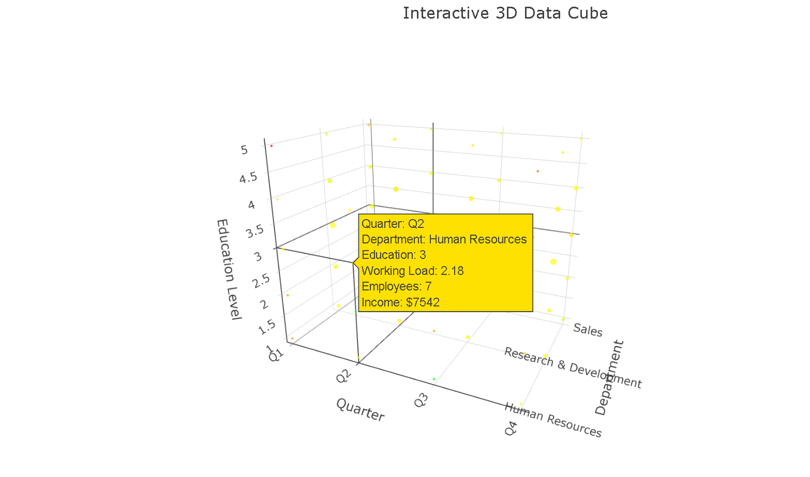
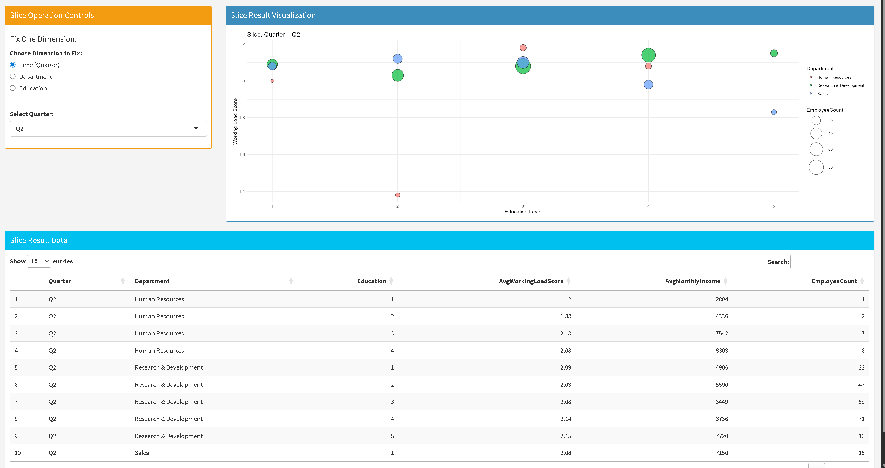
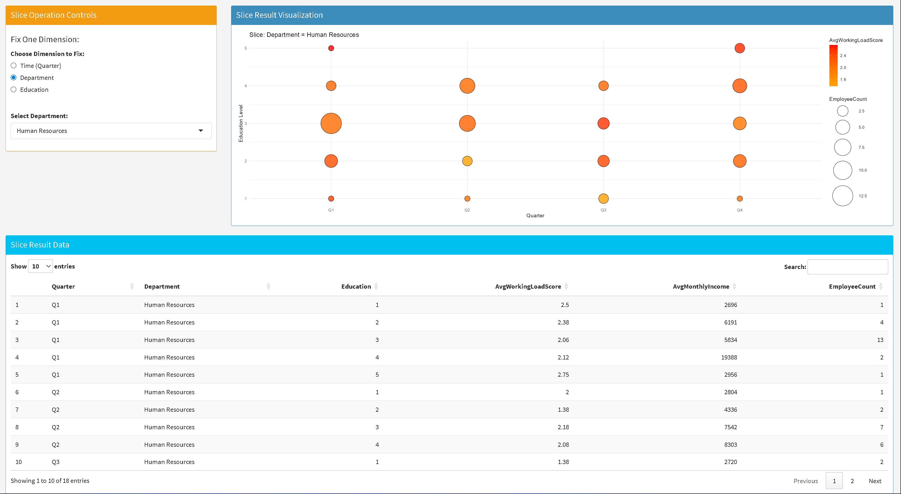
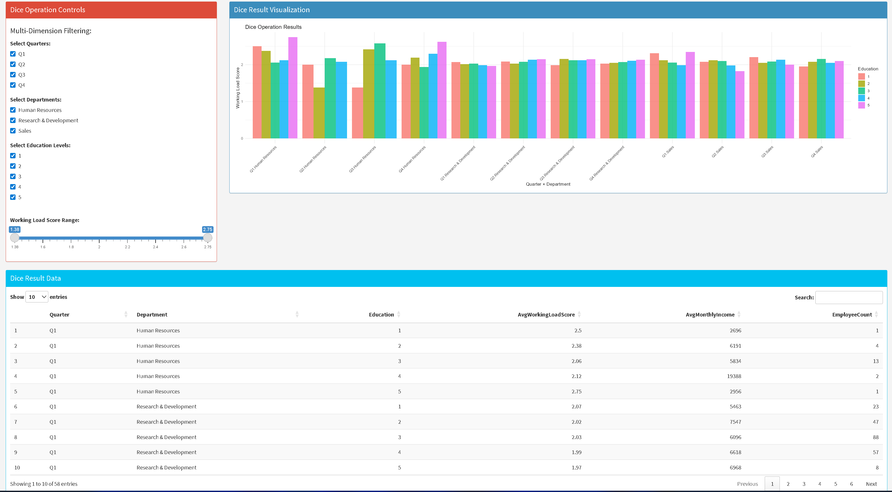

# Questions and Answers - Interactive Data Analysis

## Question 1: What does the interactive 3D data cube show us?

**Answer:** 
The interactive 3D data cube visualizes HR employee data across three key dimensions:
- **Education Level** (x-axis): Shows different levels of employee education (1-5 scale)
- **Department** (y-axis): Displays various company departments (Human Resources, Research & Development, Sales)
- **Quarter** (z-axis): Represents time periods (Q1, Q2, Q3, Q4)

Each yellow dot represents data points (likely employees) positioned in this 3D space based on their education level, department, and the quarter being analyzed. This visualization allows us to:
- Identify patterns in employee distribution across departments and education levels over time
- Spot clusters or gaps in the data
- Perform OLAP operations like slice, dice, roll-up, and drill-down to analyze employee attrition patterns
- Understand the relationship between education, department placement, and temporal trends

The cube enables multidimensional analysis of the HR Employee Attrition dataset, making it easier to discover insights about workforce composition and potential attrition factors.

## Question 2: What does the slice operation plot represent, and what is the significance of each bubble with respect to slicing in data mining?

**Answer:**

This plot shows a **slice operation** where the Quarter dimension is fixed to Q2, creating a 2D view from the 3D cube.

**What Slicing Does in Data Mining:**
Slicing **reduces dimensions** by fixing one dimension to a specific value. It's like cutting a piece from the data cube to focus on a subset.

**In This Plot:**
- Each bubble = employees with specific Education Level + Department in Q2 only
- Bubble size = number of employees
- Bubble color = department type
- Shows patterns within just Q2 data, ignoring other quarters

**Extended Analysis - Department Slice (New Image):**
The new image shows a **different slice** - this time the **Department dimension is fixed to "Human Resources"** only.

**Key Differences:**
- **X-axis**: Quarter (Q1, Q2, Q3, Q4) - time progression
- **Y-axis**: Education Level (1-5)
- **All bubbles are orange/red** because they're all Human Resources employees
- **Bubble size**: Employee count at each education level per quarter
- **Color intensity**: Represents AvgWorkingLoadScore (darker = higher workload)

**Why the Table Shows Only HR Data:**
The table displays **only Human Resources entries** because the slice operation filtered out all other departments (Research & Development, Sales). This demonstrates how slicing creates focused subsets - we can now analyze HR workforce patterns across quarters and education levels without noise from other departments.

**Purpose:** Slicing helps analysts focus on specific subsets of data (like "only Q2 employees" or "only HR employees") to find patterns without being overwhelmed by the full dataset.

## Question 3: What does this dice operation image represent, and what is dicing in data mining?

**Answer:**
This image shows a **dice operation** which is more complex than slicing - it allows **multi-dimensional filtering** simultaneously.

**What Dicing Does in Data Mining:**
Dicing **applies multiple filters across different dimensions** at once, creating a "sub-cube" rather than a simple slice. It's like selecting specific ranges or values from multiple dimensions simultaneously.

**In This Dice Operation:**
- **Multi-Dimension Controls**: Checkboxes for Quarters (Q1-Q4), Departments (HR, R&D, Sales), Education Levels (1-5)
- **Range Filtering**: Working Load Score slider (1.0-5.0) adds another filtering layer
- **Result**: A filtered dataset containing only records that meet ALL selected criteria

**The Visualization Shows:**
- **X-axis**: Quarter + Department combinations (e.g., "Q1 Human Resources", "Q1 Research & Development")
- **Y-axis**: Working Load Score
- **Colored Bars**: Different education levels (1=yellow, 2=orange, 3=teal, 4=blue, 5=pink)
- **Bar Height**: Actual working load score values

**Key Difference from Slicing:**
- **Slice**: Fixes ONE dimension (e.g., "only Q2" or "only HR")
- **Dice**: Filters MULTIPLE dimensions (e.g., "Q1-Q3 + HR & Sales + Education 1-4 + WorkLoad 2.0-4.0")

**Data Mining Benefit:**
Dicing enables complex queries like "Show me employees from Q1-Q3, in HR and Sales departments, with education levels 1-4, and working load scores between 2.0-4.0" - providing highly targeted analysis for specific business questions.

---
